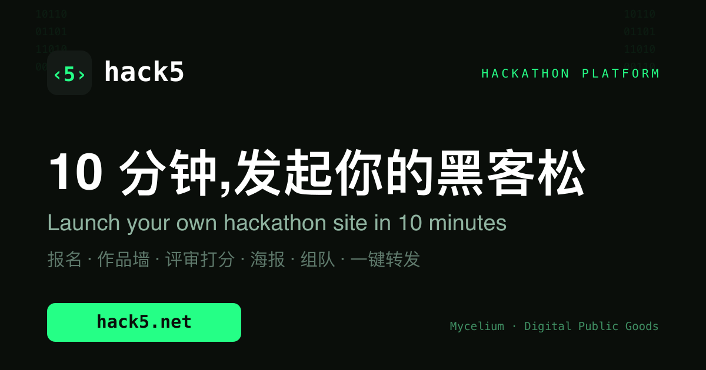
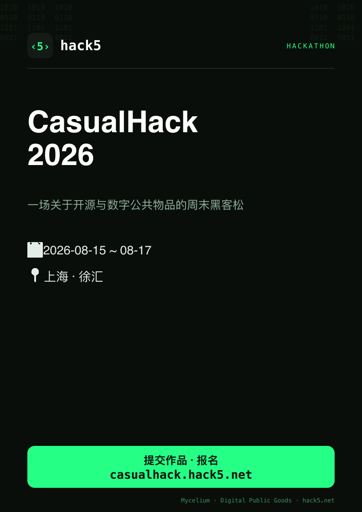
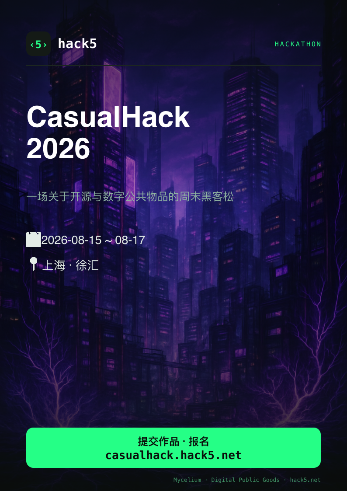

<p align="center"></p>

<h1 align="center">hack5</h1>

<p align="center"><b>10 分钟,发起并部署属于你自己的黑客松站点。</b><br>Launch your own hackathon site in 10 minutes.</p>

<p align="center">
报名 · 作品墙 · 评审打分 · 海报 · 组队 · 一键转发<br>
开源公共物品(<a href="https://blog.mushroom.cv/">Mycelium · Digital Public Goods</a>)· <b>第一场免费</b>
</p>

<p align="center"><b>Live / 线上:</b> <a href="https://hack5.net">hack5.net</a> · <b>Demo:</b> <a href="https://demo.hack5.net">demo.hack5.net</a></p>

多租户单站架构:每个黑客松是一个独立子域名(`<name>.hack5.net`),数据隔离,共享一套平台。主办邮箱登录即可创建,自动开通子域名。A single multi-tenant Worker: each hackathon is its own subdomain with isolated data; organizers create one by email login and the subdomain is provisioned automatically.

---

## 海报 / Posters

每个黑客松都能一键生成 A4 宣传海报,自动填入名称、时间、地点与报名链接。**免费版**为固定模板;**付费版**用一句话描述画风,AI(OpenAI `gpt-image-1`)生成背景,活动文字仍清晰叠加。Every hackathon can generate an A4 promo poster auto-filled from its homepage. The **free** version is a fixed template; the **premium** version paints an AI background from a text prompt (`gpt-image-1`) with crisp text kept on top.

<table>
<tr>
<td align="center"><b>免费版 / Free</b></td>
<td align="center"><b>付费版 · AI / Premium · AI</b></td>
</tr>
<tr>
<td></td>
<td></td>
</tr>
</table>

---

## 三种角色与入口 / Roles & entry points

顶部导航栏是所有入口。All entry points are in the top nav bar.

| 角色 / Role | 入口 / Entry | 凭证 / Credential | 能做什么 / Can do |
|---|---|---|---|
| **选手 / Team** | 导航「提交作品」→ `/submit` | 每队专属**邀请码** / per-team **invite code** | 提交作品、用编辑令牌改稿 / submit & edit via edit token |
| **评委 / Judge** | 导航「评审入口」→ `/judge` | 主办方发的**评委登录码** / **judge login code** | 打开作品打分(4 维度)、看排行榜 / score & view leaderboard |
| **管理员 / Admin** | 同「评审入口」→ `/judge`,填**管理口令** / same page, **admin passcode** | `ADMIN_PASSCODE` | 生成邀请码 / 评委码、锁版本、隐藏作品、导出 CSV / manage codes, lock, hide, export |

**评委登录后**:打开任一作品详情页,底部出现评分面板(创新 / 技术 / 完成度 / 展示,各 1–10)。
After a judge logs in, each submission's detail page shows a scoring panel.

**管理员登录后**:导航多出「邀请码」「评委」两页 —— 分别批量生成**每队邀请码**和**每评委登录码**(码绑定姓名,打分身份稳定,不会同名互相覆盖),生成后复制分发。
After the admin logs in, two extra pages appear — **邀请码** (batch-generate per-team invite codes) and **评委** (per-judge login codes bound to a fixed name, so scores never collide). Copy and distribute them.

主办方完整运维流程见 [HANDOVER.md](HANDOVER.md)。Full organizer runbook: [HANDOVER.md](HANDOVER.md).

---

## 开赛前必做:先生成码 / Before you open: generate the codes

> ⚠️ **数据库初始是空的。码不是每次提交时动态产生的,而是你预先批量生成、手动分发的。不先生成,选手交不了、评委进不去。**
> The DB starts empty. Codes are **pre-generated in batches by you and handed out**, not auto-created per submission. Without them, no team can submit and no judge can log in.

1. **登录管理后台**:打开 `/judge`,填管理口令 `ADMIN_PASSCODE`。登录后导航才会出现「邀请码」「评委」两页。
   Log in at `/judge` with the admin passcode; the **邀请码** and **评委** pages then appear in the nav.
2. **生成 + 查看邀请码**:进「邀请码」页(`/invites`)→ 填数量(如 100)→ 点生成 → 「复制全部未使用」→ 一队发一个。
   **这一页就是你查看邀请码的地方** —— 它列出所有码,并标注每个是"未使用"还是已被哪次提交用掉(单次有效)。
   Go to **邀请码** (`/invites`): enter a count → Generate → "复制全部未使用". **This page is where you view all codes** and their used/unused status.
3. **生成评委码**:进「评委」页(`/judges`)→ 输入评委名单(每行一个)→ 生成 → 复制,一人一个。码绑定姓名,可重复登录、改分。
   Go to **评委** (`/judges`): paste a name list (one per line) → Generate. Each code is bound to a name; judges can re-login and edit scores.

分发方式随意(微信/邮件/纸条),系统不发通知。You distribute the codes yourself (WeChat/email/etc.); the system sends no notifications.

---

## 选手怎么交 / How teams submit

一个作品 = **产品名称** + **GitHub 仓库(必须 Public)** + **演示视频链接** + **1–4 张产品截图** + 每队专属**邀请码**。

A submission = **product name** + **GitHub repo (must be Public)** + **demo-video link** + **1–4 screenshots** + your team's **invite code**.

- **代码 / Code**:就是你的仓库本体。Your repo itself.
- **README.md**:项目介绍、队伍、技术栈 —— 评委第一眼看的。The first thing judges read: intro, team, tech stack.
- **PPT**:放仓库 `/docs` 里的 **PDF**(GitHub 能在线预览),别放 `.pptx`。Put a **PDF** in `/docs` (GitHub previews it); avoid `.pptx`.
- **视频 / Video**:**不要**塞进 GitHub(单文件 100MB 限制,会撑爆仓库)。传到 **B站 / YouTube**,贴链接。Don't commit video to Git (100MB/file limit). Host on **Bilibili / YouTube** and paste the link.
- **截图 / Screenshots**:提交时上传,浏览器自动压成 JPEG,作品卡做成可左右翻页的多图轮播。Uploaded at submit time, compressed to JPEG in-browser, shown as a swipeable carousel on the card.

**三条硬规则 / Three hard rules:**
1. 视频/大文件走外链,别进 Git(否则要用 Git LFS,麻烦)。Big files via external links, not Git (LFS is a pain).
2. 仓库必须 **Public**,否则官网和评委看不到(提交时自动校验)。Repo must be **Public** (validated at submit).
3. 截止后评委可一键**锁定评审版本**(记录 commit SHA),防赛后偷改。After the deadline judges can **lock the reviewed commit SHA** to prevent later edits.

---

## 邀请码 / Invite codes

选手侧**不是共享口令**——每队一个**专属邀请码,单次有效**。管理员批量生成(100/200 个)后分发,一个码交一次作品即作废。改稿用提交时返回的**编辑令牌**,不再消耗码。

Teams do **not** share one passcode. Each team gets a **unique, single-use invite code**. The admin batch-generates them and hands one per team; a code is consumed on first submission. Editing later uses the returned **edit token**, not a code.

评委侧同理:**每人一个专属登录码**,码绑定固定姓名,打分身份稳定,不会同名互相覆盖。管理员在「评委」页按名单批量生成后分发。

Judges likewise get **one login code each**, bound to a fixed name, so scoring identity is stable and same-name overwrites are impossible. The admin generates them from a name list on the **评委** page.

---

## 官网怎么展示 / How the site shows it

- **作品墙 / Work wall**:读 D1 提交列表,每张卡异步调 GitHub API(经 Worker 代理 + 边缘缓存)显示 star / 语言 / 最后提交;主视觉是截图轮播。Cards async-load GitHub stars/language/last-push via a cached Worker proxy; the carousel is the hero.
- **作品详情 / Detail**:内嵌 B站/YouTube 视频 + 沙箱渲染 README + 截图画廊 + 「查看代码」跳转。Embedded video + sandboxed README + screenshot gallery + "view code".
- **打分台 / Scoring**:评委按 4 维度(创新 / 技术 / 完成度 / 展示,各 1–10)打分,排行榜按平均分排序,管理员可导出 CSV。Four dimensions (innovation / technical / completeness / presentation, 1–10 each); leaderboard by average; admin CSV export.

---

## 架构 / Architecture

纯 Cloudflare,单个 Worker 全包,**100 个选手在免费额度内**。All-Cloudflare, one Worker, **free tier covers 100 teams**.

- **Worker**(`src/index.ts`):UI + API + GitHub 代理。UI + API + GitHub proxy.
- **D1**:作品元数据 + 评分 + 邀请码。Submission metadata + scores + invite codes.
- **KV**(`SHOTS`):产品截图(小图,免费 1GB)。Screenshots (small images, 1GB free).
- **登录 / Auth**:口令 + 无状态 HMAC 签名 cookie,**不依赖邮件**。Passcodes + stateless HMAC-signed cookie, **no email**.
- GitHub API 走 Worker 代理带 token(5000 次/小时)+ `caches.default` 边缘缓存,避免前端直连被 60 次/小时限流。Proxied with a token (5000/hr) and edge-cached, avoiding the 60/hr unauthenticated limit.

> 视频存储 / Video storage:当前视频走外链,**不占存储**。若日后开放"直传视频到 R2",代码已保留(`VIDEO_UPLOAD` 开关),补上 R2 权限置 `on` 即可。Video is external today (zero storage). Direct-to-R2 upload code is preserved behind `VIDEO_UPLOAD`; flip it `on` once R2 access is added.

---

## 部署 / Deploy

```bash
npm install

# 建资源(需 Workers + D1 + KV 权限)/ Create resources (needs Workers + D1 + KV)
npx wrangler d1 create hackvideo-db          # 把 database_id 填进 wrangler.jsonc
npx wrangler kv namespace create SHOTS       # 把 id 填进 wrangler.jsonc
npx wrangler d1 migrations apply hackvideo-db --remote

# 设密钥 / Set secrets
npx wrangler secret put AUTH_SECRET          # 随机 32+ 字符 / random 32+ chars
npx wrangler secret put JUDGE_PASSCODE       # 发给评委 / for judges
npx wrangler secret put ADMIN_PASSCODE       # 管理员自留 / admin only
npx wrangler secret put SUBMIT_PASSCODE      # 主办方主控码(可选)/ organizer master (optional)
npx wrangler secret put GITHUB_TOKEN         # gh auth token,或只读 public_repo token

npx wrangler deploy
```

非文本 `vars`(APP_NAME / EVENT_NAME / VIDEO_UPLOAD / MAX_*)在 `wrangler.jsonc` 改。Non-secret `vars` live in `wrangler.jsonc`.

主办方运维见 [HANDOVER.md](HANDOVER.md),架构说明见 [CLAUDE.md](CLAUDE.md)。Organizer ops: [HANDOVER.md](HANDOVER.md); architecture notes: [CLAUDE.md](CLAUDE.md).

---

## 本地开发 / Local dev

```bash
cp .dev.vars.example .dev.vars     # 填口令和 GITHUB_TOKEN / fill passcodes + GITHUB_TOKEN
npm run db:migrate:local
npm run dev                        # http://localhost:8787
npm run typecheck                  # 唯一门禁,无测试套件 / the only gate, no test suite
```

---

## 成本 / Cost (100 teams)

视频走外链 → 无视频存储。截图 4×100≈几十 MB(KV 免费 1GB),D1 纯文本忽略,Workers 请求远低于 10 万/天免费额度。**免费。**

External video → no video storage. Screenshots ~tens of MB (KV free 1GB), D1 text negligible, requests far under 100k/day free. **Free.**
